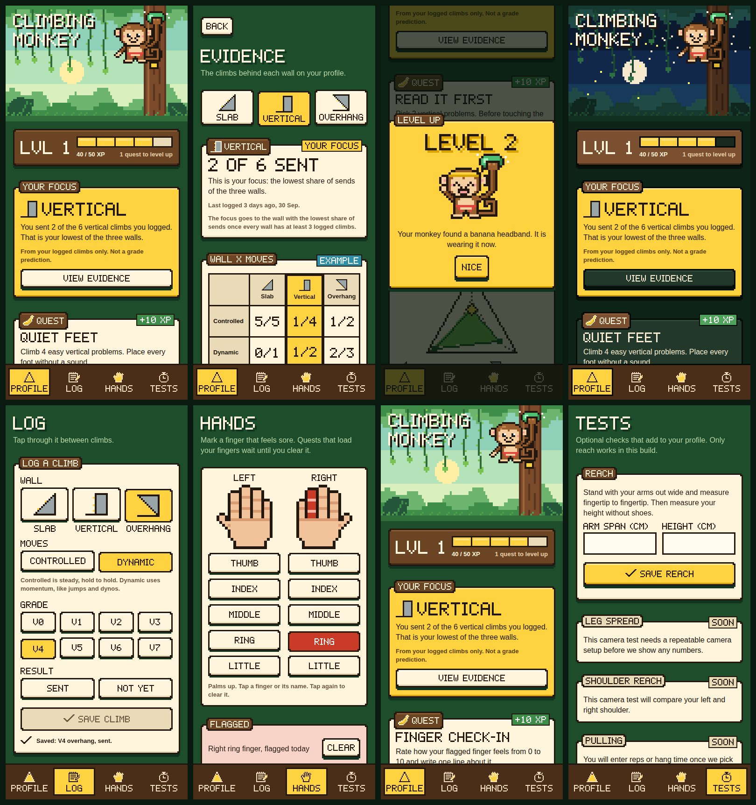
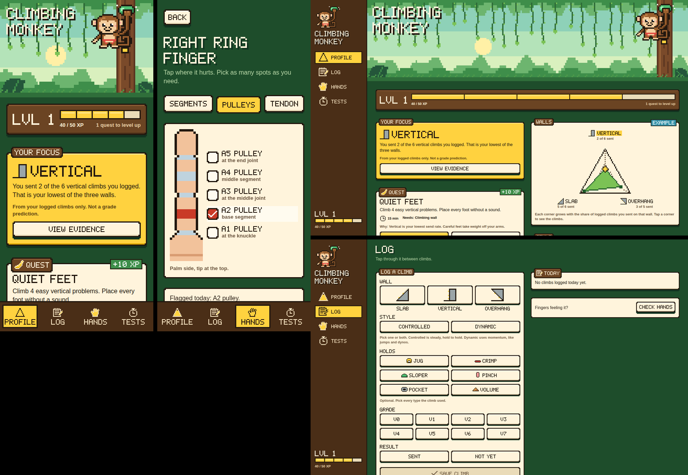

<sup><sub>If you use light mode, I'm sorry for the banner quality. But you deserve it. Screw you.</sub></sup>

# HackYeah 2026

**Climbing Monkey** is a jungle-themed, profile-first climbing app: understand your climbing styles, choose an achievable next action, and grow a monkey companion through consistent participation. It is built for the [Open: Sport & Healthcare](context/tracks/open-sport-healthcare.md) track. Read the [product design](docs/climbing-app-design.md) and [alignment analysis](docs/climbing-monkey-alignment.md). A working prototype of the profile loop (profile, focus, quests, climb log, hand flags, monkey XP) runs on labelled sample data. The rest of the design is still proposals.





The [Python/FastAPI backend](backend/README.md) implements the confirmed-evidence → profile → quest → pet XP loop, with SQLite persistence, private hand photos and optional MediaPipe pose analysis of photos, recorded clips and a sampled live camera. The web app saves to it when `VITE_MONKEY_API_URL` is set (see [Connecting a backend](#connecting-a-backend)). See the backend README for setup, API contracts and TDD checks, the [camera and video guide](docs/camera-video.md) for the capture flows, and the [scientific evidence notes](docs/climbing-scientific-evidence.md) for what the research does and does not support. Use `npm run backend:check` after creating its virtualenv.

**Music.** A small speaker key in the top-right corner of every page, setup included, plays background music: an original island loop composed in code and synthesised with Web Audio (`packages/platform/src/music`), no audio files. It is off until pressed and remembers the choice; if it was left on, it starts again at the first tap or key press, never by itself. On the web only for now: Android and iOS need a native audio library behind the same `music` capability, and the key is hidden there.

A React Native app for **Android, iOS and the web**: one codebase, with a native host for the phones and react-native-web in the browser.

| | Version |
|---|---|
| React Native | 0.84.1 (React 19.2.3) |
| Android | minimum SDK 24, target SDK 36 |
| iOS | 15.1 or later |
| Web | react-native-web 0.21, Vite 8 |
| Android application id | `com.hackyeahapp` |
| Node.js | 22.11+ (tested on 22.22 and 24.14) |

## Repository layout

```
apps/
  mobile/            Native host. One React Native project with two native targets:
    android/           Android project
    ios/               iOS project (needs macOS)
    index.js           Registers @hackyeah/app; nothing else lives here
  web/               Browser host (Vite + react-native-web), renders the same @hackyeah/app
packages/            Shared code, imported as @hackyeah/<name>
  core/              Domain logic. Plain TypeScript: no React, no react-native, no I/O
  data/              Where data lives: the backend contract, on-device storage, HTTP client
  platform/          Capability interfaces + one implementation per OS
  ui/                Jungle pixel UI kit (react-native primitives only, see its README)
  app/               Screens, navigation, root <App/>
  vision/            On-device pose: pull-up counter, dead hang and plank timers, climbing form
                     observations (plain TypeScript; the web host passes MediaPipe in)
context/             Hackathon brief, rules and judging criteria (Markdown)
```

Dependencies only flow downwards: `app → ui, data, platform, core`, and `data → core, platform`. `core` depends on nothing, and the hosts in `apps/` stay thin. To add another target (a tablet layout, a different web shell, a desktop app), write a new host that renders `@hackyeah/app`. If the target needs different native behaviour, add a `capabilities.<platform>.ts` file in `packages/platform`.

### How platform-specific code is selected

Shared code imports `react-native` and `@hackyeah/platform` normally. Each bundler then picks the right implementation:

| Target | Bundler | `react-native` resolves to | `capabilities` file used |
|---|---|---|---|
| Android / iOS | Metro | `react-native` | `capabilities.ts` |
| Web | Vite | `react-native-web` | `capabilities.web.ts` |

If Android and iOS ever need different code, add `capabilities.android.ts` or `capabilities.ios.ts`; Metro picks those before `capabilities.ts`. Screens read capabilities through `useCapabilities()`, so tests inject fakes with `<App capabilities={...} />`.

### Connecting a backend

Screens only talk to `useGame()`. It saves through a `ClimbingBackend` from `packages/data`: on-device storage by default, or the HTTP API when a server address is set. Endpoints and JSON shapes each live in one file. See [packages/data/README.md](packages/data/README.md).

To use the FastAPI backend, run `npm run backend:setup` once, then `MONKEY_CORS_ORIGINS=http://localhost:5173 npm run backend:start`, and start the web app with `VITE_MONKEY_API_URL=http://127.0.0.1:8000 npm run web`. Without the variable the app keeps everything on the device. Native builds read `API_BASE_URL` in `packages/data/src/config.ts` instead. The same address is used by the camera screens (the camera assessment on the Tests tab and hand photos on the Hands tab); without a server they say they need one. See the [camera and video guide](docs/camera-video.md).

## Setup

```sh
npm run setup        # installs apps/mobile and apps/web
npm run check        # typecheck + lint + tests (no device or SDK needed)
```

There are deliberately **no npm workspaces**. The Android build expects `node_modules` directly in `apps/mobile` (`android/settings.gradle` loads `../node_modules/@react-native/gradle-plugin`). The shared packages have no dependencies of their own: Metro, Vite, Jest and TypeScript are configured to resolve their imports from the host app.

## Run on the web

```sh
npm run web          # dev server
npm run web:build    # static build in apps/web/dist
```

## Run on Android and iOS

Install the Android SDK and a JDK, or Xcode on macOS, as described in React Native's [environment setup](https://reactnative.dev/docs/set-up-your-environment).

1. Start Metro: `npm start`.
2. **Android:** start an emulator or connect a phone with USB debugging on, then run `npm run android`.
3. **iOS** (macOS only): run `bundle install && bundle exec pod install` in `apps/mobile/ios`, then `npm --prefix apps/mobile run ios`.

Edits to `packages/` or `apps/mobile` hot-reload through Metro.

### Release builds (no Metro needed)

The native builds bundle the JS themselves:
- **Android:** `cd apps/mobile/android && ./gradlew assembleRelease`. The APK is written to `apps/mobile/android/app/build/outputs/apk/release/`.
- **iOS:** open `apps/mobile/ios/HackYeahApp.xcworkspace` in Xcode and choose **Product > Archive**.

### Checking a native build without a device

`npm run check` needs no device or SDK. To confirm that Metro resolves every import for a native build, write a release bundle outside the repository:

```sh
cd apps/mobile
npx react-native bundle --platform android --dev false --entry-file index.js \
  --bundle-output /tmp/android.js --assets-dest /tmp/assets
```

Use `--platform ios` for the iOS bundle. Don't write bundles into `android/` or `ios/` by accident.

### Native features

React Native provides the core APIs (`Platform`, `Vibration`, `BackHandler`, `SafeAreaView`, …) on both phones. For anything else, add a native module to the Android and iOS projects and wrap it behind an interface in `packages/platform/src/types.ts`. Implement it in `capabilities.ts`, with a fallback in `capabilities.web.ts`.

**Music on Android and iOS** is not there yet. The web plays it with Web Audio (`capabilities.web.ts`); a phone needs a native audio library (for example one that plays a rendered loop) wrapped as the `music` capability in `capabilities.ts`. Until then `music` is undefined and the app hides the music key.

**Third-party libraries:** a library with native code needs a native rebuild (and `pod install` on iOS), and it won't run in the web host, so keep it behind a capability with a web fallback. Pure-JS libraries work everywhere as they are.

## Notes and troubleshooting

- **SafeAreaView deprecation warning.**
  - RN 0.84 warns that `SafeAreaView` is deprecated. The built-in one needs no extra native dependency, so we keep it and silence that single warning in `apps/mobile/index.js`.
  - To switch to `react-native-safe-area-context`, change `packages/ui/src/components/Screen.tsx` only.
- **Release signing.** Android release builds are signed with the template's debug keystore (`android/app/debug.keystore`). Generate your own key before publishing and never commit it; other `*.keystore` files are gitignored.

## AI usage

AI tools were used during development; see [AI_WORKFLOW.md](AI_WORKFLOW.md).
