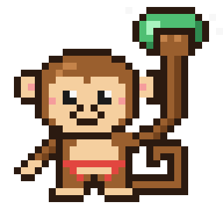
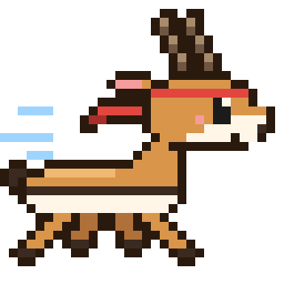

# Sport pets

Pixel-art mascots, one per sport mode. 32×32 sprites, generated by
[`tools/pixel_pets.py`](../../tools/pixel_pets.py). Edit the sprite there and re-run
`python3 tools/pixel_pets.py` (PNG/GIF output needs Pillow; SVG does not).

| Pet | Mode | Animation |
| --- | --- | --- |
|  | Climbing monkey: hangs from a hold, wears a harness | blinks |
|  | Running gazelle: mid-gallop with a sweatband | 2-frame gallop |

Files per pet: `<name>.svg` (vector), `<name>.png` (10× still), `<name>.gif` (animated),
`<name>-sheet.png` (1× sprite sheet, frames left to right, for in-app animation).

AI disclosure: the sprites and generator were drawn by Claude Code (Anthropic) as pixel grids.
