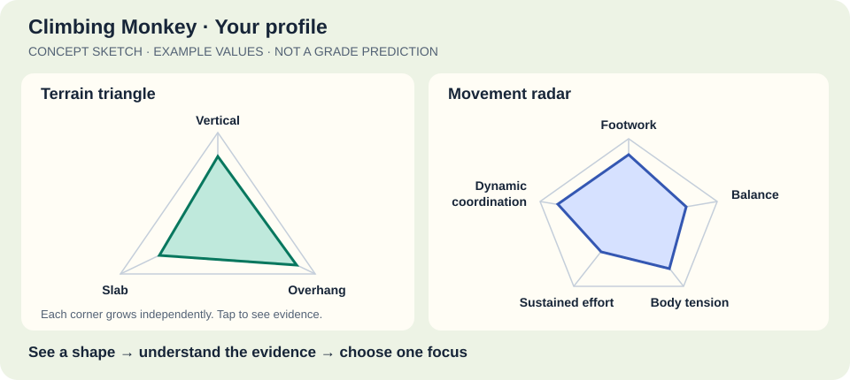

# Climbing Monkey — initial design

Date: 3 October 2026

Status: working draft. Profile-first direction is confirmed; detailed scope, scoring and technical choices remain proposals.

Primary brief: [Open: Sport & Healthcare](../context/tracks/open-sport-healthcare.md). Detailed fit and recommended priorities: [alignment analysis](climbing-monkey-alignment.md).

## Idea

**Climbing Monkey** is a jungle-themed React Native app that helps climbers understand their strengths, weaknesses and changes over time. It combines guided physical tests, camera-based movement estimates, activity history and a visual hand/recovery journal into one personal climbing profile.

The central loop is **assess → understand → choose a focus → track → reassess**. The profile should answer: “What do I know about my climbing today, what could I work on, and what has changed?”

Working initial audience: recreational indoor boulderers who struggle to decide what to work on next and tend to repeat familiar styles. They need a useful next-session focus that accounts for their climbing history, assessments and current wellbeing. This narrower audience is a proposed starting scope to validate with users; sport climbing remains a later expansion.

The problem is fragmented information: a grade or activity log does not by itself explain style differences, a mobility test lacks climbing context, and a hand observation can get lost when planning the next session. Climbing Monkey connects those records into an explained focus and an achievable action. This is the product's direct response to the sports brief, not a claim that physical tests can predict grades.

## Product direction — confirmed: profile first

The main product is a clear, actionable climbing profile. People should immediately see how they are doing across climbing styles, understand what supports that picture, and choose something useful to do next. The profile is the home screen and the destination after every assessment or new climbing observation.

Tests, activity history and the hand journal supply evidence and context to that profile. Form coaching and the guided pain flow are supporting extensions. Prioritize features by whether they improve the user's understanding or next action.

The core experience is **see your shape → understand a strength or focus area → take one action → see what changed**. Success means a user can explain their profile and act on it, not simply collect measurements.

A companion pet makes that action loop rewarding: the user improves their climbing habits while leveling up a character. The pet lives alongside the profile and helps present its next action.

## Visual identity — confirmed: jungle theme

The app is called **Climbing Monkey**, and its companion is a monkey. The visual direction is a welcoming jungle: canopy greens, warm cream surfaces, earthy accents and restrained leaf/vine details. Use a brighter accent for the selected focus and primary action, with accessible contrast across text, controls and charts.

The monkey grows through levels and cosmetic unlocks such as jungle accessories or changes to its habitat. A small jungle scene can frame the companion on the profile screen. Progress can be represented as the monkey climbing through the canopy, while the explicit level and XP bar keep the mechanics understandable.

Keep the jungle decoration around the functional content. Terrain triangles, radar axes, evidence cards and hand maps use simple shapes, readable labels and calm backgrounds. Leaves and vines must not obscure chart points, resemble data lines or interfere with camera overlays. Use familiar action labels such as “Start assessment” and “View evidence”; themed language can add personality without replacing clear instructions.

Movement illustrations and the monkey can carry the playful character. Symptom and recovery screens use quieter jungle styling and straightforward language. Support reduced motion for celebrations and provide text descriptions for meaningful visual states.

## 1. Guided physical assessments

Each test has a short explanation, setup illustration, camera framing guidance, recording step, quality check and a result the user can accept or repeat. Tests are optional and skippable, including when a movement is uncomfortable.

| Assessment | Possible input | Result and limitation |
|---|---|---|
| Comfortable leg spread / split position | Pose landmarks from a consistent camera angle | Estimated angle for that test; do not equate a wide stance with a validated flexibility assessment |
| Shoulder reach / overhead movement | Guided pose capture | Estimated range and left/right comparison; requires a repeatable protocol |
| Arm span and height | Manual measurements, with optional camera assistance | Reach information and arm-span-to-height ratio; camera dimensions require calibration and validation |
| Pulling strength / endurance | User-entered repetitions, hold duration and test conditions | Performance in the chosen test; pose tracking can assist timing or counting but does not measure force |
| Finger strength | Optional measured results from suitable equipment | Keep separate from hand appearance; no strength estimate from a hand photo |
| Movement control | A short, predefined movement recording | Candidate form observations, subject to validation |

Camera-based measurements are estimates. Keep the setup, units, timestamp, method, model version and capture quality with each result. Reject incomplete or unreliable captures instead of manufacturing a score. Allow manual entry when camera analysis is unavailable.

For the first prototype, prioritize one repeatable mobility test and manual reach measurements. Add strength tests only after choosing an appropriate protocol.

## 2. The climbing profile

Organize the profile into mobility, reach/body proportions, strength, endurance, movement control, and activity/recovery context. Reach is descriptive: body proportions should not be ranked as a weakness.

Each card shows the latest result, its source, its age, a trend where comparable results exist, and an explanation. Missing information appears as “not assessed.” Distinguish measured, estimated, imported and self-reported data.

Initially, compare people with their own previous results under similar conditions. The visual style profile below is a proposed way to summarize climbing ability more specifically than a single grade. Population rankings, numerical grade predictions and calibrated composite scores require defensible reference data; they are outside the first version.

Example presentation:

> Your recorded leg-spread angle increased across two comparable tests. Pulling strength has not been assessed. You logged discomfort in your right ring finger yesterday, so finger-loading suggestions are paused.

Strengths and focus areas must point back to evidence. Use explicit, reviewable rules for the first version. An optional language model could explain structured results later, but should not invent measurements or diagnoses.

### Visual style profile: terrain triangle and movement radar

The profile should be visual first: recognizable shapes, plain labels and an obvious next action. Its purpose is to act as a more informative proxy for a single climbing grade: “What kinds of climbing currently suit me, and where could I improve?” It should describe likely style strengths without claiming an exact predicted grade.

The sketch uses illustrative values only; it defines the visual concept, not scoring thresholds or a measured climber profile.

**Terrain triangle:** three labeled spokes for **slab**, **vertical** and **overhang**. Each value grows independently from the center toward its corner, forming a personal triangle inside the outline. A climber can improve on all three; this must not be a triangle where moving toward one corner automatically takes ability away from another. Pair each corner label with a small wall-angle icon so the terrain is recognizable without reading a legend.

**Movement radar:** a small, consistently ordered radar with candidate axes for **precise footwork**, **balance**, **body tension**, **sustained effort** and **dynamic coordination**. Each axis needs its own observable evidence and explicit scale before being scored. Keep raw physical assessments one tap away rather than disguising flexibility or arm span as a direct technique score.

**Static/controlled and dynamic movement:** show two independent labeled indicators. Static means controlled movement between positions; dynamic includes momentum-based movement such as dynos. These are not opposite ends of a single ability slider: a person can be good at both. This is the working interpretation of the initial “dyno vs dyno” suggestion.

**Combined view:** use a three-column, two-row grid when the user wants the intersection. Columns are slab, vertical and overhang; rows are controlled and dynamic. Each cell represents evidence for that combination, such as “controlled slab” or “dynamic overhang.” The grid combines the two ideas more clearly than a radar with six similarly named axes. Routes can contain both movement types, so tags need not be mutually exclusive.

| Movement / terrain | Slab | Vertical | Overhang |
|---|---|---|---|
| Controlled | Style evidence + next focus | Style evidence + next focus | Style evidence + next focus |
| Dynamic | Style evidence + next focus | Style evidence + next focus | Style evidence + next focus |

**Evidence and scoring:** collect user-confirmed route style, grade system, attempts, completion, date and perceived difficulty. Physical tests provide supporting context; actual climbing records and later validated movement observations provide more direct evidence. Store whether an insight is reported, observed or inferred. Initial style cards can summarize logged outcomes without inventing a universal score. Only draw a scored polygon once a consistent scoring method and enough comparable evidence exist; otherwise show labeled axes and missing-data states. Prototype shapes using sample values must say “Example.”

**Make it actionable:** tapping a corner, radar axis or grid cell opens the supporting observations, one explained focus and one appropriate next step. For example, “You logged fewer successful vertical climbs at your chosen difficulty; log another vertical route to clarify this pattern.” Where coaching content is reviewed and supported by evidence, the next step can become a specific practice suggestion. The overview should prioritize one focus rather than presenting five simultaneous weaknesses.

**Clarity rules:**

- Directly label shapes and axes; do not rely on color or a hidden legend.
- Keep axis order, scale and orientation stable across sessions. Explain what outward means.
- Show unknown values as gaps or hatched regions, never zero or a weakness; do not close a polygon through missing axes.
- Keep evidence confidence separate from ability; show recency and number of observations in the detail view.
- Offer a text summary and accessible controls alongside every chart.
- Keep temporary discomfort as a separate visible badge or overlay; do not shrink the user's ability shape because of an active symptom report.
- A previous-profile outline is optional and appears only when scales and inputs are comparable.

Initial release: terrain triangle, static/dynamic indicators and evidence details. Include the movement radar as a core visual design requirement, but use an unscored or explicitly labeled sample state until its axes can be supported. The combined grid is a progressive detail view rather than the first thing the user sees.

Keep **ability**, **preference** and **exposure** separate. Enjoying slab or logging few overhangs does not establish slab ability or an overhang weakness. Preserve the gym/location, grade system and bouldering/route discipline alongside outcomes so unlike climbs are not silently treated as comparable.

## 3. Activity and health context

Potential sources include Strava, platform health services, wearable data and manual session logs. Candidate fields are activity type, session duration, frequency, sleep and user-reported fatigue, where available and permitted.

Treat integrations as separate adapters with explicit consent. Verify each provider's available fields, permissions and target-platform support before promising an integration. General exercise duration is context, not a direct measure of finger load or climbing ability.

Store source and original timestamps, deduplicate imported activities, and show when data was last synced. Denied permission, a disconnected account or an unavailable field must leave the core profile usable. Use clearly labeled sample data or manual entry for the demo if real integrations are not ready.

## 4. Visual hand and recovery journal

The user can photograph either hand, mark a region, describe discomfort or visible skin changes, and return later to add another observation. Capture guidance encourages similar lighting, distance, orientation and palm/back views.

Features:

- Separate left/right hand maps with selectable fingers, joints, palm and back of hand.
- A heatmap of **user-reported discomfort** for a selected date or period, with a clear legend and separate “no report” state.
- A timeline linking photos, annotations, symptom ratings, activity notes and user-reported milestones.
- Side-by-side photos and elapsed time since the first report.
- Optional hand landmark alignment to help place annotations consistently; users confirm or correct the location.

Photos document visible changes. They do not establish internal tissue condition, healing, or readiness to climb. Track recovery through the user's observations and clinician-provided information where supplied; do not predict a recovery date from photos alone.

Hand symptoms influence the profile as a temporary constraint. They must not reduce a permanent ability score. The initial rule is to pause suggestions that load a flagged region and explain why.

## 5. Form coach — later extension

Use the same camera and landmark pipeline to review a small set of defined movements. Start with controlled assessment or exercise footage before attempting arbitrary climbing videos.

Potential outputs include timestamped observations about joint angles, left/right differences and movement consistency. Feedback should reference visible evidence and acknowledge inadequate framing or occlusion. Camera setup, wall angle and movement context must be considered before making climbing-technique claims.

## 6. Guided pain walkthrough — optional extension

This fits naturally inside the hand journal: tap a region → describe the issue → answer structured questions → save the report → receive an appropriate next step.

The visual flow could highlight the selected finger on a hand illustration or a confirmed camera overlay. Collect onset, location, symptom description, activities associated with discomfort and changes over time. Free text can be converted into structured fields for the user to confirm.

The original idea of “press here and see whether it hurts” is a candidate for a future clinician-designed assessment, not a diagnostic capability of pose tracking. A camera cannot measure applied pressure or reliably identify the injured structure. Do not include provocative pressure/loading tests in the prototype.

Before offering symptom-based care advice, have qualified clinicians define and review the questions, escalation criteria and response content. Keep routing deterministic and explainable; a language model must not independently choose a diagnosis or treatment. Until that work is done, the extension can collect symptoms, create a summary for a professional and offer a route to seek help.

## 7. Companion pet and personalized quests

The user has a monkey companion that gains experience (XP), levels up and unlocks cosmetic changes as they complete useful actions. It acts as an encouraging companion on the profile screen, with a visible level, progress bar and one current quest. The app name, monkey character and jungle theme are confirmed; the monkey's personal name and final illustration style remain open.

**Quest loop:** profile evidence identifies a possible focus → the pet offers a suitable task → the user completes or adapts it → the pet earns XP → a later reassessment checks whether the underlying capability changed.

Tasks can include a reviewed mobility/stretching routine, technique practice, a climbing reflection, a missing assessment or a recovery check-in. For example, if repeated comparable assessments suggest limited mobility relevant to the user's goal, the pet could offer a suitable stretching routine from a reviewed library. The card explains why it was selected, how to follow the routine, how completion is recorded and when to recheck. Specific stretches and their dosage need review before release; this design does not prescribe a routine.

### Selecting a task

- Start with one user-selected goal and one supported focus area from the profile. Let the user accept, swap, postpone or dismiss the suggestion.
- Use an explicit mapping from evidence to a reviewed task library. Each task records its target skill, prerequisites, equipment, estimated duration, instructions, exclusions and review/version information.
- Limited evidence produces an assessment or logging quest, not a claim that the user is weak. Few overhang attempts alone must not trigger a strength or stretching prescription.
- Match the task to the demonstrated limitation: a mobility result may support mobility work; low success on dynamic climbs does not automatically mean the user needs stretching.
- Respect current symptoms and task exclusions. Pause affected exercise quests and offer an appropriate check-in or other eligible task. Symptom-based rehabilitation remains part of the separately reviewed pain extension.
- Begin with deterministic selection rules and explanations. If AI helps word a quest later, it must preserve the approved task and must not invent an exercise or dosage.

### Clear visual presentation

The selected triangle corner or radar axis gets a visible focus marker, linked to the pet's quest card. The card shows **what to do**, **why this helps the chosen focus**, a small movement illustration where useful, estimated time and a single start/complete action. Completion produces a short pet celebration and updates the XP bar. The activity is saved to history so the user can see what they tried before reassessing.

The pet's growth and the climber's profile are separate. Finishing a stretch earns participation XP; it does not automatically increase mobility or slab ability. Only new assessment or climbing evidence can change those values. Completion can be self-reported; label it rather than pretending the camera verified an exercise it cannot assess.

### Progression rules

For the prototype, use one pet, a small reviewed quest set, a simple level bar and one level-up cosmetic. Proposed initial rule: each unique completed quest earns 10 XP; every 50 XP earns a level. This is a tunable game rule, not an assessment score. Persist completion IDs so retries or repeated taps cannot award duplicate XP.

Reward reflection, assessments and appropriate recovery actions as well as practice. No XP multipliers for harder climbs, longer holds, painful activity or excessive volume. Skipping, taking a rest day or being injured does not remove XP, harm the pet or reset its level. Keep streaks optional and avoid guilt-based notifications. A user can hide the pet while keeping profile actions available.

## Main screens and flow

1. **Onboarding:** climbing goals, experience, optional body measurements and separate permissions.
2. **Profile:** terrain triangle, movement radar, controlled/dynamic indicators, one focus, companion pet with level/XP and current quest, recent changes and active symptom flags; tap through to evidence or the combined style grid.
3. **Assessments:** available tests, setup guidance, capture and result confirmation.
4. **Hands:** visual map, photo capture, annotations and history.
5. **Activity:** session logs and optional connected sources.

Primary demo flow: open clearly labeled previous climb/assessment evidence → inspect the visual profile → choose one supported focus and its explanation → add a hand/wellbeing observation → see any affected quest paused or replaced by an eligible option → complete/log that option → see monkey XP → return later with new evidence to compare progress. Include one live assessment/manual entry in the flow. Ability changes require new evidence, whereas quest completion changes pet XP.

### Low-effort regular use and accessibility

Proposed routine: a brief post-session check-in for terrain/movement tags, attempts/outcome and optional wellbeing context, followed by one current focus. Aim for completion within a minute as a usability target to test, not a measured claim. Assessments, detailed photos and external-account connections are optional; do not make users repeat onboarding or a full test battery to receive value.

Provide labeled controls, screen-reader summaries of charts, non-color state indicators, reduced motion and manual entry alternatives. Quests show time/equipment requirements and offer adaptation, postponement or skipping. A person who cannot perform a suggested movement should still be able to log activity, review evidence and choose an eligible action.

## Proposed technical shape

Use the repository's existing React Native structure, with HarmonyOS as the current native target and web as a supporting host.

| Layer | Responsibility |
|---|---|
| `backend/` | Python/FastAPI APIs, authoritative confirmed evidence, profile rules, quest eligibility, persistent XP and optional server pose processing; see [backend design](backend-design.md) |
| `packages/core` | Client domain types, display transformations and local validation; pure TypeScript. Consume server profile/XP results rather than duplicating authoritative rules |
| `packages/platform` | Camera, photo storage, persistence, pose/hand inference and external-data capabilities behind interfaces |
| `packages/ui` | Terrain triangle, movement radar, style grid, pet/XP display, quest cards, profile cards, capture overlays, hand maps and timeline components |
| `packages/app` | Screens, navigation, permissions and orchestration |
| `apps/*` | Thin platform hosts; native bridges where required |

Data flow: camera/manual/imported input → quality checks and normalization → confirmed observation → persisted history → profile rules → explained result.

Backend implementation now exists for anonymous profiles, confirmed records, descriptive style summaries, assessment trends, private hand photos, historical discomfort maps, eligible journal/reflection quests, pet XP and optional pose analysis. The React Native UI is still the scaffold and is not yet wired to those APIs. Server measurements and stored records are opt-in capabilities; the client must show what leaves the device and obtain upload/retention consent.

Core records: `ClimberProfile`, `AssessmentResult`, `ActivityRecord`, `HandObservation`, `PhotoAsset` and `ProfileInsight`. An insight references the observations and rule version that produced it. A hand observation records side, view, anatomical region, timestamp, symptoms and optional photo; hand landmark detection must not silently decide the affected region.

Gamification records: `PetProgress`, versioned `QuestDefinition`, `AssignedQuest` and `QuestCompletion`. An assigned quest references its supporting profile insight and selection rule. Completion records its timestamp, reporting method and awarded XP; pet progression is persisted separately from ability measurements.

MediaPipe is a candidate, not a settled dependency. Google documents body landmarks in image/world coordinates and hand landmark detection, which could support overlays and movement estimates. Those capabilities do not themselves provide calibrated anthropometry or injury assessment. See the [Pose Landmarker guide](https://developers.google.com/edge/mediapipe/solutions/vision/pose_landmarker) and [Hand Landmarker guide](https://developers.google.com/edge/mediapipe/solutions/vision/hand_landmarker).

The documentation reviewed does not establish a ready-to-use HarmonyOS/RNOH integration. The Python backend now provides an optional MediaPipe Tasks image adapter; real inference on an official sample succeeded outside the macOS sandbox. This does not establish on-device HarmonyOS feasibility. Validate native capture, client consent, latency and any native inference bridge separately. Manual assessment entry remains available; demonstration data must be labeled.

## Privacy and failure behavior

- Clients can keep raw captures locally. Using the backend sends confirmed records to server SQLite storage; no email/password account is required, but the client must protect its issued anonymous bearer token. On-device processing remains a platform option to validate.
- Ask separately for camera access, photo retention and external data connections. Request access when the relevant feature is used.
- Retain assessment metrics by default; raw assessment recordings require explicit opt-in. Journal photos are saved only when the user chooses to keep them.
- If remote processing becomes necessary, disclose what is uploaded and obtain consent before sending it.
- Support deletion of photos and records, export of the journal, and disconnection of integrations. Recompute affected insights after deletion.
- Low-confidence inference prompts recapture or manual entry. Missing health data remains missing. Older results show their age.

## Suggested hackathon scope

**First working loop:** one guided assessment with manual alternative, an explainable visual profile with terrain triangle and movement radar (honest missing-data/sample states where needed), simple route-style logging, a basic hand/wellbeing entry that changes quest eligibility, and persistent history. Complete this connected loop before expanding individual screens.

**Supporting product features:** manual reach measurements, hand photo annotations, a discomfort map and richer history. These remain in the full design; prioritize them after the first working loop is stable.

**Gamification slice:** one pet, one eligible quest at a time, persistent XP and one cosmetic level-up. Start with assessment/reflection quests; add stretching or practice quests once their content and eligibility rules have been reviewed. This supports the confirmed profile-first direction.

**Stretch:** live pose inference on the target device, one real activity integration, or one validated form observation. Choose based on feasibility rather than attempting all three.

**Later:** broader assessments, clinically reviewed pain routing, recovery guidance and richer climbing-video coaching.

Success for the first demo means the connected loop works on the demonstrated host, every profile statement links to its evidence, poor captures fail clearly, and the hand/wellbeing journal visibly changes relevant quest eligibility. Users should be able to name one focus, explain why it was suggested and choose an achievable action. Mocked inputs must be labeled. Running on HarmonyOS is a separate verification requirement if that host is presented as working.

### Fit with the supplied hackathon context

The primary product brief is **Open: Sport & Healthcare**. Its criteria are innovation 30%, category fit 20%, usability 20%, design 20% and completeness/implementation value 10%. The profile, achievable quests, accessible presentation and sustainable monkey progression directly support the brief. The jungle theme supports design quality but cannot replace practical value. See the [sports track digest](../context/tracks/open-sport-healthcare.md).

Prioritize a working connected flow using climb records, one assessment and a wellbeing observation. Manual data entry can demonstrate this connection; real Strava/health integrations and live inference are stretch goals, not track eligibility conditions. Keep the existing HarmonyOS implementation choice, but do not trade away the user journey merely to maximize native features.

Sports submission: title, team, members, description and a PDF deck of at most 10 slides. The track permits Polish or English; the supplied general upload form requires English fields/materials, a title of at most five words, description of at most 500 words and at least one gallery image. Prepare to those narrower limits. A repository, demo link and up-to-60-second video are optional for sports; disclosure of significant AI/external resources is required. Keep `AI_WORKFLOW.md` as our disclosure log. See [submission constraints](../context/ProjectSubmissionUpload.md). The start-time wording and submission-platform mismatch remain organizer questions.

**Separate Huawei option:** only if submitting there, apply its API 20+, working `.hap`, device/emulator demo, public repository, recorded demo, reproducibility and `AI_WORKFLOW.md` requirements. Native platform capability has a separate 20% weight there. These do not transfer to the sports open task. See [Huawei requirements](../context/tracks/huawei-harmonyos.md).

## Further features from research

These are candidates, not additional commitments for the first version. The charts and style scoring remain product hypotheses; the cited studies do not validate a radar chart or a conversion to climbing grades.

| Feature | Contribution to the profile | Priority / evidence |
|---|---|---|
| Style-tagged climb log | Terrain, movement tags, attempts and outcomes give the triangle actual climbing evidence | Core; manual entry is sufficient to start |
| Focus → practice → recheck card | One selected area becomes a pet quest, practice experiment and follow-up observation | Adopted into the gamification direction; practice content needs review. A [motor-learning study](https://www.frontiersin.org/journals/psychology/articles/10.3389/fpsyg.2018.00949/full) examines movement repertoire during structured practice, not automatic personalized coaching |
| Route preview and reflection | Annotate an intended sequence or crux on a route photo, then record what changed | Later; a [route-preview study](https://journals.plos.org/plosone/article?id=10.1371/journal.pone.0176306) examines preview strategies and climbing behavior |
| Comparable-test badge | Explain when previous/current observations used the same setup | Early; a [finger-strength assessment study](https://pubmed.ncbi.nlm.nih.gov/29578838/) illustrates that measurement setup matters |
| User-confirmed video annotations | Add movement evidence without making every camera observation an authoritative coaching claim | Later; [CIMI4D](https://arxiv.org/abs/2303.17948) provides research context for climbing motion capture, not proof of reliable phone-only coaching |

## Validation before implementation commitments

- Compare the chosen camera test with a reference measurement and repeat captures under varied lighting, camera positions and body types. Define acceptable error before presenting numeric results as useful.
- Verify annotation persistence across hand views and repeat photos; test manual correction when tracking fails.
- Exercise missing data, stale results, conflicting sources, deletion and disconnected integrations.
- Check that users can identify a terrain strength, an unknown style and a next action from the overview; verify charts preserve independent abilities and do not imply a validated grade prediction.
- Check that symptom flags pause the intended suggestions and cannot be interpreted as medical clearance.
- Verify quests reference supporting evidence, respect exclusions and can be skipped; completion awards XP once, persists across restarts and never changes ability scores without new evidence.
- Validate camera/inference and storage on HarmonyOS hardware or the appropriate emulator; assess privacy and performance before adding remote services.

## Decisions for the next discussion

- Validate the proposed indoor-boulderer audience and next-session planning need with users.
- Choose the first physical test and what a useful, repeatable result looks like.
- Decide whether the demo emphasizes live assessment or the visual hand journal if native inference proves expensive.
- Choose the first external source after checking platform support and available data.
- Decide whether clinician input is available for the optional pain walkthrough.

These are open product decisions, not prerequisites for preserving the idea in this draft.
