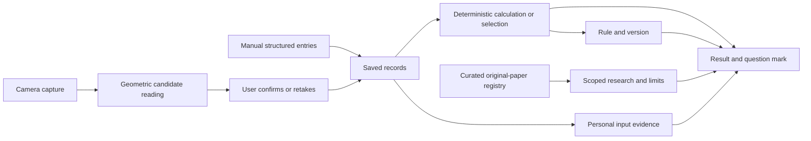

# Decision evidence: records, rules and research

The app derives results from structured observations and deterministic rules. A question mark beside a generated result or recommendation explains the actual inputs used, how the rule produced the output, related original research and the limits of that research. A paper in the library is not evidence that the app, its camera, or its personalized quest has been validated.

This document describes the existing input path and the decision-disclosure contract. Research scope, populations and reading depths are in [climbing-scientific-evidence.md](climbing-scientific-evidence.md), including the research extension verified on 4 October 2026. No natural-language interpretation system is introduced by this work.

## The data path

A climb log supplies date, terrain, one or more movement categories, optional hold types, entered grade and completion. These are user selections. The app does not infer technique quality from the words in a note. A hand report supplies side, region, selected spots and a discomfort value or an unrated sore flag. A note and photo remain journal material; neither is interpreted as an injury diagnosis. Body measurements and home-test results are entered values under a recorded method/protocol, or explicitly labeled candidate camera values.

The server camera path computes an image-plane angle from the hip midpoint to the two ankles. A visibility-based capture gate can reject inadequate input. It does not turn an accepted reading into an anatomically validated mobility measurement. A saved camera assessment follows user confirmation. Visibility, accepted capture and user confirmation are distinct from measurement accuracy. The vision package also contains deterministic rep/hold/form rules with model, method, thresholds and time/frame evidence; simulated sources carry `simulated: true`. Native keypoint support and integration status are documented in [the vision README](../packages/vision/README.md). A library implementation or developer harness does not establish a validated live app feature.

## Local and server decisions have different authority

The local profile calculates descriptive tallies from `GameState.logs`. For terrain, movement or a terrain/movement cell, it counts logged and completed climbs. One climb can count in both movement categories. The local rate is completed/logged and is hidden until three matching records exist. Those three records are a product threshold, not a scientific sample-size requirement.

Local focus selection first considers terrains with fewer than three logs, choosing the least recorded terrain. Once all terrains meet the threshold, it chooses the lowest completion rate. Equal candidates follow the fixed order slab, vertical, overhang. Local quest selection uses that focus, completed/skipped quest IDs, library order and active finger flags. Finger-loading candidates pause while any finger is flagged; a matching check-in can lead. A skipped quest is moved behind other options. The local library’s climbing drills remain draft content; the number of problems and estimated minutes are product choices. Local focus and quest selection do not use body size, home-test values or the selected goal; their rationale must not imply those values drove the choice. Drill descriptions should state the factual log trigger and exploratory practice intent without claiming a measured loading mechanism.

The server owns its assigned quest. Its profile selects a reflection terrain only among terrains with at least three records and a completion rate below one, choosing the lowest eligible rate. A reported active hand region takes priority over a goal or reflection; a mobility goal then selects an assessment task; otherwise the server can select reflection or general evidence gathering. Its hand flag comes from the latest report per side/region with null or positive discomfort, including regions beyond the local finger-only flag display. The two focus algorithms are intentionally described separately; local profile inputs cannot reconstruct the reason for a legacy server quest as historical fact.

An assigned server quest stores its decision explanation with the inputs used at assignment. That snapshot identifies the trigger records, dates and relevant values, plus the rule/version and limitations. The data adapter preserves the server explanation and converts `source_ids` to `sourceIds`. A later change in the live profile does not rewrite an assigned decision snapshot. Deleting a referenced personal record redacts duplicated personal details in stored decision snapshots; historical traceability must not preserve information the user deleted. Eligibility can change with current records, so assignment-time rationale and current pause status answer different questions. Existing quests with no recorded explanation must explicitly report unavailable provenance; paper links or current logs cannot fill the historical gap.

Local disclosures are calculated from the same current state as their displayed output. They show dated local records and relevant selection controls. A local record may lack an original server ID or report history; any local display key is an app reference, never an invented original observation ID. Do not silently enrich local values with dates, methods, source versions or histories that were discarded by an adapter. Imported, demo and simulated data must retain their known labels; unknown provenance stays unknown.

## What each question mark exposes

The shared `DecisionExplanation` contract in [core evidence](../packages/core/src/evidence.ts) contains `summary`, `status`, `rule`, personal `evidence`, scholarly `sourceIds` and `limitations`, plus an optional `inputSummary` and `flow` for drawing. Each personal evidence item has an ID/reference, label and detail, and optionally a `view` for its short row. Published sources have a separate stable registry ID and metadata: title, authors, year, original URL, study type, population, reading depth, supported scope, limitations and verification date.

| Generated result | Inputs and rule to disclose | Evidence boundary |
|---|---|---|
| Terrain/movement/grid counts | Matching climb IDs/dates/categories/completion; exact numerator, denominator and three-log gate | Outcomes of the logged climbs; grades, exposure and route choice can differ |
| Local focus | All terrain totals/rates and fixed tie order | Reflection/collection heuristic, not measured weakness |
| Local quest and pause | Focus, flags, completed/skipped IDs, quest filtering/order and loading eligibility | Draft drill and product dose; a cleared flag is not health clearance |
| Assigned server quest | Assignment-time record snapshot, server goal/rule/version and authoritative explanation | Missing legacy provenance is unavailable; current state is not the original snapshot |
| Camera estimate | Actual four hip/ankle coordinates and visibility values, image dimensions or square assumption, formula/protocol, and output; model/capture time when supplied | Image-plane estimate; no transferred accuracy from another pose paper |
| Camera rep/hold/form candidate | Actual capture source and rule thresholds, frame/time evidence when available | App detection criteria and visibility are unvalidated for performance/diagnosis |
| Home-test/body entry and computed ratio | Entered value/unit/date; recorded protocol; arm-span/height ratio or arm-span-minus-height calculation | Descriptive measurements; qualitative display labels and test-to-area grouping are app choices |
| Assessment comparison | Latest and previous values with matching metric, method, protocol and unit; subtraction | A delta is not evidence of meaningful improvement without measurement-error data |
| Example radar | Explicit example status and its illustrative values | No personal input produced the polygon; no validated ability axes |
| XP/level/reward | Unique completed quest IDs; 10 XP each, 50 XP per level, unlock rules | Participation reward, not strength, healing, mobility or readiness |

Sources are shown as related research with a specific supported scope. A purely arithmetic or eligibility rule can have no scholarly source; saying so is more informative than attaching an unrelated paper. Research-supported statements must retain study-type distinctions, including abstract-only reading, laboratory constructs and single cases. New preview/feedback/training papers supply context for candidate features; none establishes the app’s exact drill or dose. The older load-sharing paper is separately labeled conference proceedings with unverified peer-review status.

## Original material and future extraction boundary

Today the decision pipeline consumes explicit fields. Free-text hand notes are stored as notes; movement categories are selected by the climber. A future note/video interpreter must first produce a **candidate observation** tied to the original note excerpt or video time/frame interval, source identifier, extraction method/model/version and uncertainty. It must show that original material and let the user confirm, correct or reject the interpretation before using it as a personal profile input or recommendation trigger. This is a future requirement, not an implemented NLP capability.

For example, “I fell after changing feet” does not establish a footwork deficit. A candidate could identify a reported event and link its exact note; the climber must confirm its category. A detected pause is a measured still interval under software thresholds, not evidence of poor route reading: it could reflect planning, rest, occlusion or a deliberate move. Confirmation makes an observation attributable and correctable; it still does not validate its causal interpretation.

Keep personal observations, derived calculations, rule choices, published research and missing information visible as separate parts of the explanation. No reviewed treatment library, stretching dose, photo healing assessment or return-to-climb protocol is implied by this contract.

## How a question mark presents an explanation

A small superscript ? sits beside each generated value (`HelpMark` in `packages/ui`). It opens one sheet over the page (`DecisionHelp` and `ExplanationSheet` in `packages/app/src/components/DecisionHelp.tsx`), in the same order everywhere:

1. One sentence saying what the result means. Sample data adds a quiet "Built from sample data" note; draft content says it has not been reviewed.
2. **Your inputs:** one plain line on what fed the result (`inputSummary`, for example "6 vertical climbs: 2 sent, 4 not yet."), then the records as short rows: short date, a grade or distance badge, the wall or kind icon, style and holds, and a Sent / Not yet (or Finished / Cut short, Flagged) stamp, drawn from each record's optional `view`. Internal record IDs are not drawn; a screen reader hears each record's full `label` and `detail`. Example records are marked once with a sample note, not on every row. The first three show, the rest behind **Show all N**. Records without a `view` (server snapshots) show their label and detail. With no records, the sheet says they were not saved.
3. **How it works:** where the explanation has a `flow`, the rule is drawn as a jungle vine (`DecisionFlow` in `packages/app/src/components/DecisionFlow.tsx`, Views only): input chips at the top feed a funnel, green holds are steps, wooden signs are yes/no checks with the branch taken in banana with a check mark and the other dashed and labelled "not taken", records that join part way (a flagged finger, quest progress) hang beside the vine where they are used, and the pet holds up the result at the bottom. Team choices carry a TEAM RULE stamp. The picture is one accessible image whose label is core's `flowText`, and the plain text rule stays one press away under **Rule in words**. Without a valid flow (server explanations, home tests, the example radar) the rule shows as text lines, one step per line. No rule IDs, booleans or field names either way. It ends by saying the rule was chosen by the team, or for a camera reading that the formula is the app's own.
4. **Research:** only where a published claim is made. One plain finding per study and a short citation (first author, year, title link). Full study details sit behind one **Study details** control. Arithmetic and selection rules (tallies, focus, XP, log quests, drills) cite no papers.
5. **Limits:** one or two short lines.

The flow shape (`DecisionFlow` in [core flow](../packages/core/src/flow.ts)) is `inputs` (label, value, icon hint, `key` for the input the result is about), `nodes` (steps, and checks with `taken: 'yes' | 'no'`, each with optional `detail`, `team` and a side `feed` input) and a `result`. The explain functions fill it from the same values as the text rule, and the branch taken follows the decision actually made (focus kind, flags present, three-log gate, tie). `isDecisionFlow` guards persisted or foreign data before drawing.

The Evidence page (and its sport version) is one column at every width, at most 640 px wide: the wall picker, the wall summary and focus, the wall x style grid, then the climbs. Its wall x style boxes open the same sheet when tapped. On Profile the slab, vertical and overhang tallies sit below the triangle in a folded **How was this data created?** section. Server snapshots, deletion redaction and the `DecisionExplanation` contract are unchanged; a server explanation is shown as the server wrote it.
